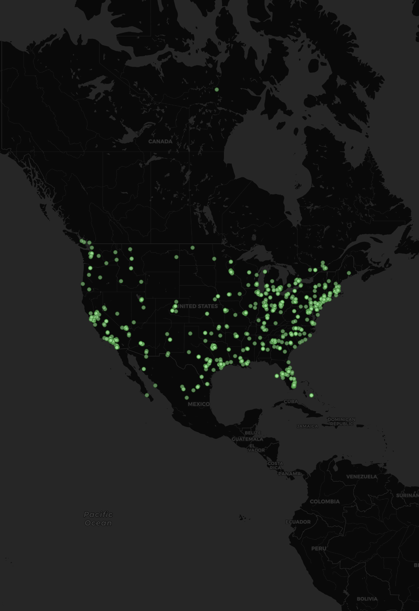
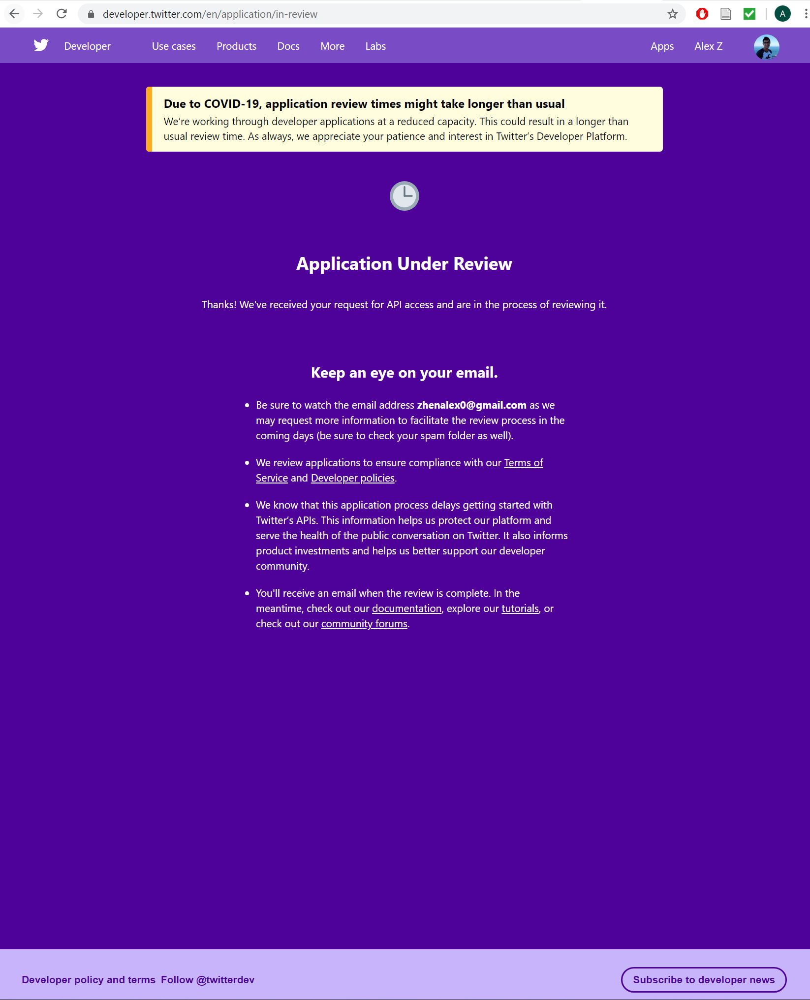
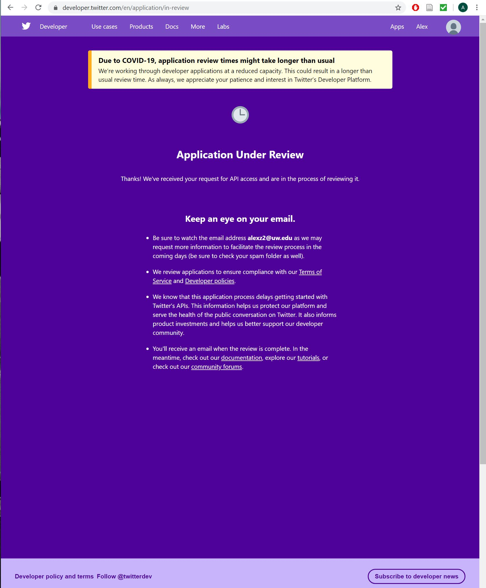

<!DOCTYPE html>
<html>
  <head>
  </head>
  <body>

# alexz1Lab2.github.io

<h5> The picture above from the sample.csv folder is the amount of people using the Twitter App throughout the United States. This data here is georeferenced so we know where most of these tweets are from. From above, most of the Tweets are from the east coast as there are more points on right side of the map than the left side. Majority of the tweets are located around the New York & New Jersey area. I am not sure when this data was crawled but I would imagine it would be early morning on the West Coast which people on the East Coast have already started their days. Many of these tweets consist of random tweets for many people as their is no consistent category. </h5>

<h5> Unfortnaley, I do not know much about the data in the picture (above) as my Twitter Developer Account is still pending even after a couple days. If I was able to run my crawler I would have inserted a keyword that is "Traffic" as the parameter to see how people are reacting about the traffic volumes due to the pandemic. That would be some interesting data to see. </h5>

 Below is the proof required to show that my application for a developer account is still pending. First account is my personal email (Notice Picture on the top right corner). Second picture is my UW account. 

  </body>
</html>
